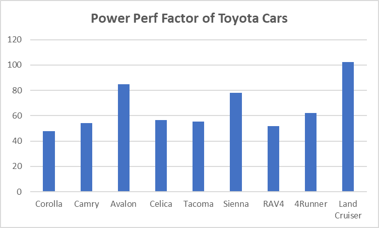
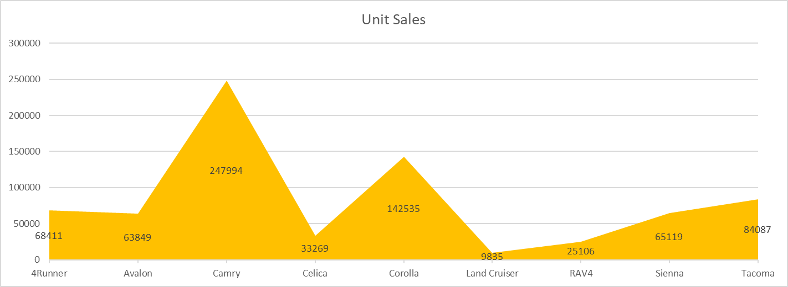
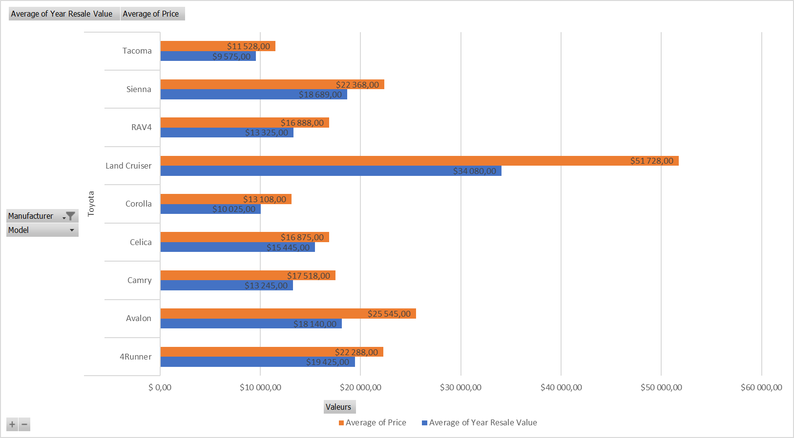
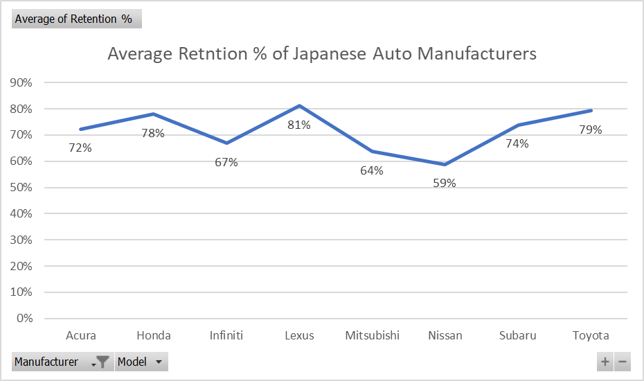

# 📊 Lab 1 – Création de graphiques de base avec Excel

Bienvenue dans ce projet pratique réalisé dans le cadre du IBM Data Analyst Professional Certificate.

Ce TP avait pour objectif de se familiariser avec la création de graphiques de base dans **Excel pour le web**, à partir de données de ventes de voitures.

## 🗂 Objectifs du Lab

✅ Créer un graphique en colonnes  
✅ Créer un graphique en aires  
✅ Créer un graphique en barres à partir d’un tableau croisé dynamique  
✅ Créer un graphique en lignes à partir d’un tableau croisé dynamique

---

## 📁 Données utilisées

Les données sont issues du jeu de données [Car Sales](https://www.kaggle.com/gagandeep16/car-sales) disponible sous licence CC0 : Public Domain.  
⚠️ Le fichier utilisé dans ce TP est une version modifiée fournie par le cours.

---

## 🧪 Étape 1 : Graphiques en colonnes et en aires

### 🧱 A. Graphique en colonnes

Filtrage des voitures de la marque **Toyota** pour afficher leur Power Performance Factor.

📌 Résultat :  
📷 

---

### 🌄 B. Graphique en aires

Même filtrage, mais représentation des **Unit Sales** avec un graphique en aires, stylisé avec un remplissage doré.

📌 Résultat :  
📷 

---

## 📊 Étape 2 : Graphiques issus de tableaux croisés dynamiques

### 📊 A. Graphique en barres

Utilisation d’un TCD pour regrouper les ventes par modèle **Toyota**, et affichage des résultats avec un **Clustered Bar Chart**.

📌 Résultat :  
📷 

---

### 📈 B. Graphique en lignes

Analyse des pourcentages de rétention moyens des constructeurs **japonais**, visualisés avec un graphique en lignes avec marqueurs.

📌 Résultat :  
📷 

---

## 👨‍🏫 Auteur du Lab

> Ce TP a été réalisé à partir des ressources pédagogiques du cours IBM – Data Analyst Professional Certificate  
> Auteurs du TP : *Sandip Saha Joy*, *Steve Ryan*

---

## 🧠 Réalisé par

**Assiawassa Yendi (Yohann)**  
🎓 Étudiant en Master Big Data & IA  
🔗 [Portfolio](https://yohannkp.github.io/portfolio) – [GitHub](https://github.com/Yohannkp) – [LinkedIn](https://linkedin.com/in/yendi-aharh)  
