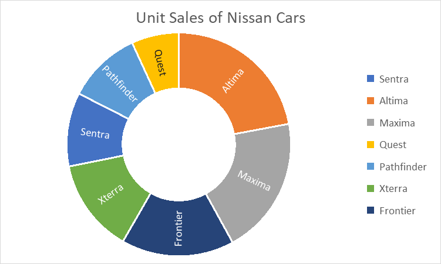
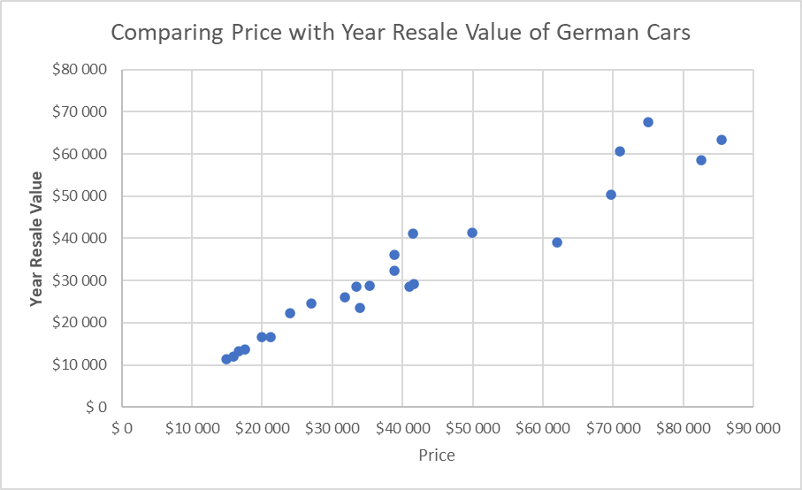
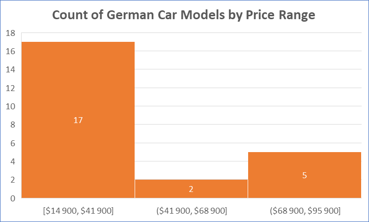

# 📊 Lab 2 – Création de graphiques avancés avec Excel

Ce TP fait partie de ma progression dans le parcours **IBM Data Analyst Professional Certificate**.

Dans ce deuxième lab, l’objectif était de se familiariser avec des **graphiques plus avancés** dans Excel, notamment le **sunburst chart**, le **scatter plot** et l’**histogramme**, en utilisant **Excel pour le web**.

---

## 🗂 Objectifs du Lab

✔️ Créer un graphique hiérarchique (Sunburst)  
✔️ Créer un nuage de points (Scatter chart)  
✔️ Créer un graphique statistique (Histogramme)

---

## 📁 Jeu de données utilisé

Données issues de [Car Sales – Kaggle](https://www.kaggle.com/gagandeep16/car-sales), sous licence CC0 (Public Domain).  
⚠️ Attention : le fichier utilisé est une **version modifiée fournie avec le lab**.

---

## 🧪 Étapes réalisées

### 🌞 A. Sunburst Chart – *“Unit Sales of Nissan Cars”*

Filtrage des données pour n’afficher que les voitures de la marque **Nissan** puis création d’un graphique de type **sunburst**.

📷 **Aperçu du graphique :**  

---

### 🔘 B. Scatter Chart – *“Comparing Price with Year Resale Value of German Cars”*

Sélection des marques **allemandes** (Audi, BMW, Mercedes-B, Porsche, Volkswagen) et création d’un **nuage de points** comparant le prix et la valeur de revente.

📷 **Aperçu du graphique :**  

---

### 📊 C. Histogram – *“Count of German Car Models by Price Range”*

Filtrage sur les marques allemandes et génération d’un **histogramme** pour visualiser la distribution des modèles par tranches de prix.

📷 **Aperçu du graphique :**  

---

## 👨‍🏫 Auteur du Lab

Lab proposé dans le cadre du cours IBM  
Auteurs : *Sandip Saha Joy*, *Steve Ryan*

---

## 🧠 Réalisé par

**Assiawassa Yendi (Yohann)**  
🎓 Étudiant en Master Big Data & Intelligence Artificielle  
🔗 [Portfolio](https://yohannkp.github.io/portfolio) – [GitHub](https://github.com/Yohannkp) – [LinkedIn](https://linkedin.com/in/yendi-aharh)

---

> _"Explorer les données, c’est découvrir des vérités cachées dans le bruit."_
