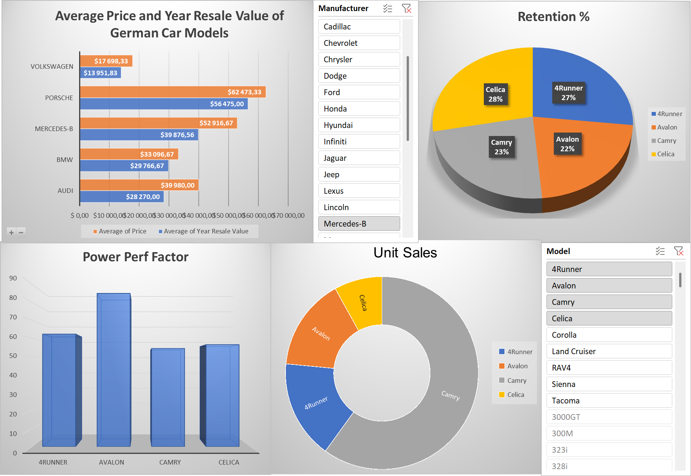

# 📊 Lab 3 – Création d’un tableau de bord simple avec Excel

Ce TP fait partie de mon parcours dans le **IBM Data Analyst Professional Certificate**.

L’objectif de ce troisième lab est de **créer et organiser un tableau de bord interactif dans Excel**, en combinant plusieurs graphiques issus d’un jeu de données de ventes automobiles.

---

## 🎯 Objectifs pédagogiques

✔️ Créer un tableau de bord avec Excel  
✔️ Organiser un layout visuel efficace  
✔️ Utiliser des slicers et des visuels variés (colonnes, secteurs, hiérarchiques…)

---

## 📁 Jeu de données

Les données proviennent du dataset [Car Sales](https://www.kaggle.com/gagandeep16/car-sales) (licence : CC0 - Public Domain).  
💡 *Attention : le fichier utilisé est une **version modifiée** fournie avec le lab.*

---

## 🧪 Étape 1 : Mise en place des visuels

Dans cette première partie, j’ai :

- Créé une feuille nommée `Dashboard`
- Copié et collé plusieurs graphiques depuis d’autres onglets :
  - 📊 Graphique en colonnes
  - 🥧 Diagramme en secteurs (Pie Chart)
  - 🌞 Diagramme hiérarchique (Sunburst)
  - 📊 Graphique en barres
- Ajouté deux **slicers** pour filtrer dynamiquement les données :  
  - Par **constructeur**
  - Par **modèle**

---

## 🧱 Étape 2 : Configuration de la mise en page

J’ai ensuite organisé le dashboard pour optimiser sa lisibilité :

- Bar Chart : en haut à gauche
- Manufacturer Slicer : en haut à droite du graphique
- Pie Chart : en haut à droite
- Column Chart : en bas à gauche
- Sunburst Chart : en bas au centre
- Model Slicer : en bas à droite

🔧 J’ai aussi :
- Désactivé les **grilles et en-têtes**
- Activé la **multi-sélection** dans le slicer
- Personnalisé le titre du graphique principal :
  > “Average Price and Year Resale Value of German Car Models”

📷 **Aperçu du dashboard final organisé :**  

---

## 🧠 Réalisé par

**Assiawassa Yendi (Yohann)**  
🎓 Master Big Data & Intelligence Artificielle  
🔗 [Portfolio](https://yohannkp.github.io/portfolio) – [GitHub](https://github.com/Yohannkp) – [LinkedIn](https://linkedin.com/in/yendi-aharh)

---

## 👨‍🏫 Auteurs du Lab

> TP proposé par IBM dans le cadre du **IBM Data Analyst Professional Certificate**  
> Rédigé par : *Sandip Saha Joy*  
> Autre contributeur : *Steve Ryan*
