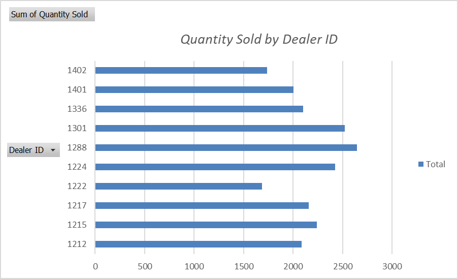
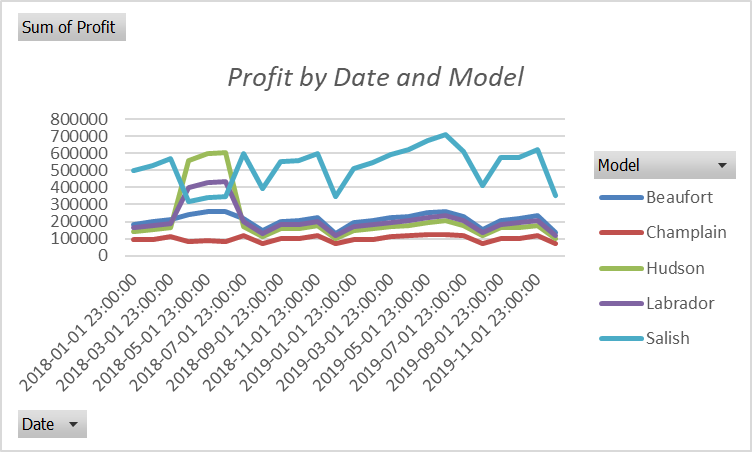
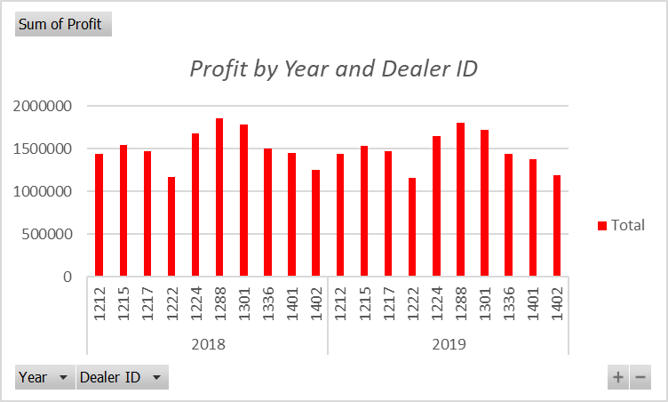
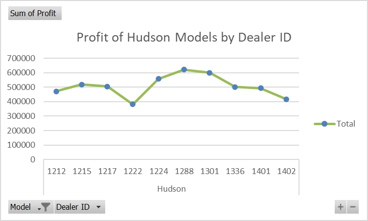

# 📊 Peer-Graded Assignment – Final Assignment: Part 1

Ce projet marque la **conclusion du cours** sur l’analyse de données avec Excel, dans le cadre du **IBM Data Analyst Professional Certificate**.

🎯 L’objectif : créer des visualisations à partir de données réelles issues du secteur automobile, pour **analyser les ventes et les profits par concessionnaire**.

---

## 🗂 Objectifs du projet

✔️ Créer un bar chart, un line chart et un column chart à partir de TCD  
✔️ Personnaliser les titres, couleurs, légendes et axes  
✔️ Finaliser un tableau de bord de performance pour une chaîne de concessions automobiles

---

## 📁 Jeu de données

Les données utilisées proviennent du catalogue [IBM Accelerator Catalog](https://community.ibm.com/accelerators/?context=analytics&type=Data&product=Cognos%20Analytics&industry=Automotive).  
🔹 Licence : [IBM Developer Terms of Use](https://developer.ibm.com/terms/ibm-developer-terms-of-use/)  
⚠️ Une version modifiée a été fournie pour l’exercice.

---

## 🧪 Tâches réalisées

### 📊 **Tâche 1 : Quantity Sold by Dealer ID**

- Création d’un **bar chart** depuis un TCD
- Tri des données par quantité vendue
- Personnalisation du titre :  
  > *Quantity Sold by Dealer ID*

📷 

---

### 📈 **Tâche 2 : Profit by Date and Model**

- Création d’un **line chart** à partir d’un second TCD
- Mise en évidence de la performance par modèle et par date
- Titre du graphique :  
  > *Profit by Date and Model*

📷 

---

### 📊 **Tâche 3 : Profit by Year and Dealer ID**

- Utilisation d’un **column chart**
- Personnalisation de la couleur des barres (rouge)
- Titre du graphique :  
  > *Profit by Year and Dealer ID*

📷 

---

### 💹 **Tâche 4 : Profit of Hudson Models by Dealer ID**

- **Line chart** pour un modèle spécifique : *Hudson*
- Suppression des **lignes de grille horizontales**
- Déplacement de la **légende à droite**
- **Contour vert** pour la série de données
- Titre du graphique :  
  > *Profit of Hudson Models by Dealer ID*

📷 

---

### 💾 **Tâche 5 : Sauvegarde finale**

- Enregistrement du fichier final sous :  
  `CarSalesByModelEnd.xlsx`

---

## 🧠 Réalisé par

**Assiawassa Yendi (Yohann)**  
🎓 Étudiant en Master Big Data & Intelligence Artificielle  
🔗 [Portfolio](https://yohannkp.github.io/portfolio) – [GitHub](https://github.com/Yohannkp) – [LinkedIn](https://linkedin.com/in/yendi-aharh)

---

## 👨‍🏫 Auteurs du projet

> Projet proposé par IBM dans le cadre du certificat professionnel  
> Auteur : *Steve Ryan*  
> Contributeur : *Sandip Saha Joy*
